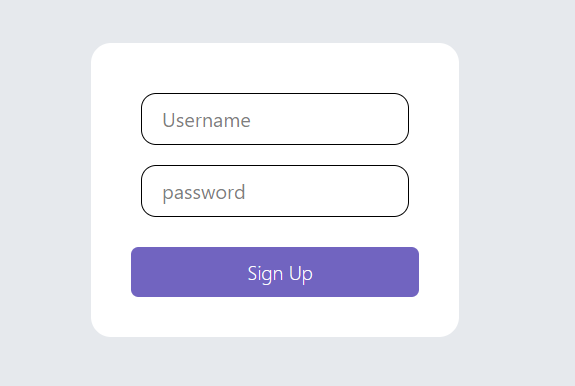
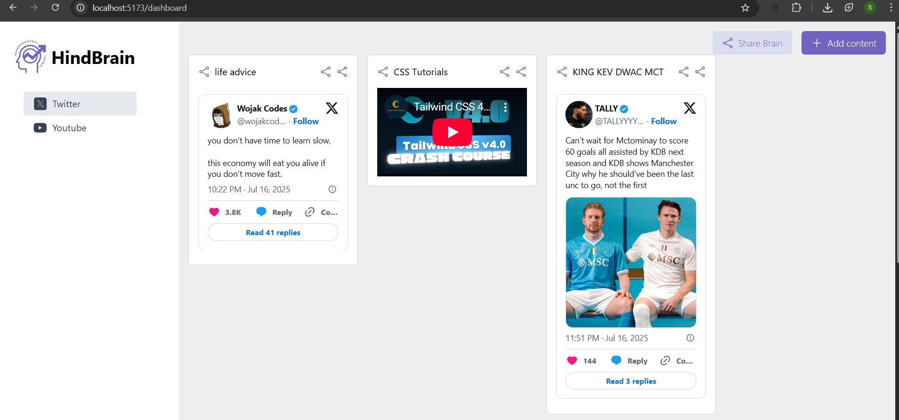
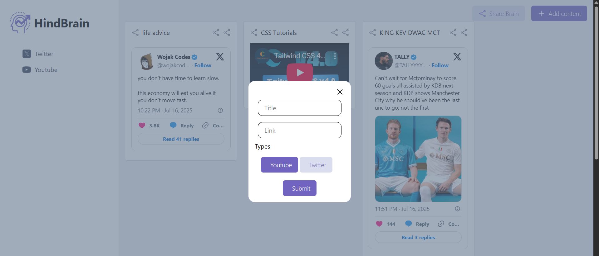
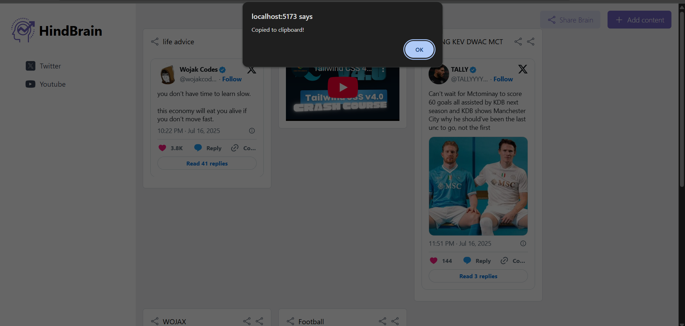

# 🧠 HindBrain

**HindBrain** is your second brain — a personalized platform to save, organize, and share YouTube videos and Twitter threads. Inspired by the "Second Brain" productivity system, this app helps you capture digital knowledge fast and visually.

---

## 🌐 [🔗 HindBrain GitHub Repo](https://github.com/mehtasanchit/HindBrain/tree/master)

---

## 🚀 Features

- 🔒 JWT-based login and signup
- 🎯 Save Twitter threads and YouTube videos in categorized boards
- 📌 Organize by title, tags, and type
- 🧠 Copy, share, and view notes instantly
- 🎨 Beautiful, responsive UI built with TailwindCSS
- 🧩 Built with **MERN Stack** (MongoDB, Express, React, Node.js,Typescript)

---

## 📸 Screenshots

> UI Previews of HindBrain in action:

### 🧾 Signup UI

### 🧠 Dashboard

### 📦 Add Content Modal

### 🔗 Share / Copy Feedback

---

## 📦 Tech Stack

| Layer       | Tech                            |
|-------------|----------------------------------|
| Frontend    | React.js + Tailwind CSS          |
| Backend     | Node.js + Express                |
| Database    | MongoDB (Mongoose ODM)           |
| Auth        | JSON Web Tokens (JWT)            |
| Hosting     | *Local for now* (can deploy to Vercel/Render)

---

